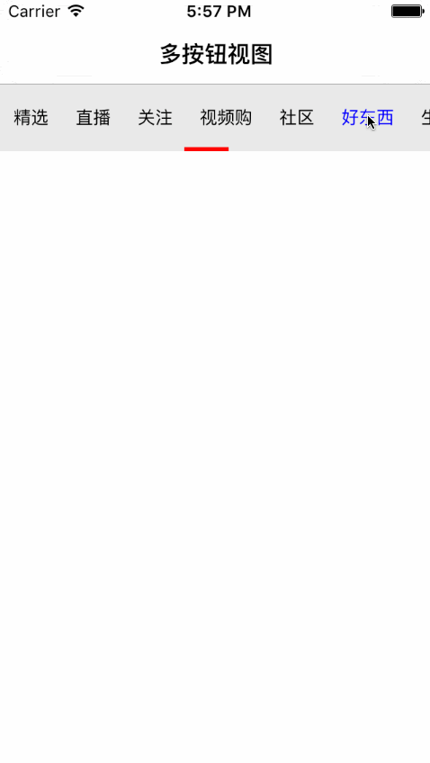

# SYSegmentView
多种按钮样式（带图标筛选按钮视图、多按钮选择滚动视图……）

# 使用介绍
* 自动导入：使用命令pod 'SYSegmentView'导入到项目中
* 手动导入：或下载源码后，将源码添加到项目中

# 多选按钮视图控件



代码示例
``` javascript
// 引入头文件
#import "SYSegmentView.h"
``` 

``` javascript
// 实例化
NSArray *titles = @[@"精选", @"我的直播间", @"关注", @"视频购", @"社区", @"好东西", @"生活", @"数码", @"亲子", @"风尚", @"美食"];
//
SYSegmentView *segmentView = [[SYSegmentView alloc] initWithFrame:CGRectMake(0.0, 0.0, self.view.frame.size.width, 50.0)];
[self.view addSubview:segmentView];
segmentView.backgroundColor = [UIColor colorWithWhite:0.5 alpha:0.2];
segmentView.titles = titles;
``` 

``` javascript
// 属性设置
// 间距
segmentView.spacing = 20;
// 线条
segmentView.lineVisible = NO;
segmentView.lineAnimation = NO;
segmentView.lineAutoWidth = YES;
segmentView.indexSelected = 3;
segmentView.lineHeight = 30;
segmentView.lineTop = 10;
segmentView.lineColor = UIColor.orangeColor;
// 字体样式
segmentView.fontNormal = [UIFont systemFontOfSize:13];
segmentView.fontSelected = [UIFont systemFontOfSize:18];
segmentView.colorNormal = UIColor.orangeColor;
segmentView.colorSelected = UIColor.greenColor;
// 
[segmentView reloadSegment];
```

``` javascript
// block回调
segmentView.buttonClick = ^(NSInteger index) {
	NSLog(@"block click index = %@", @(index));
};
``` 

``` javascript
// 代理协议
SYSegmentViewDelegate

// 代理
segmentView.delegate = self;

// 代理方法
- (void)segmentView:(SYSegmentView *)segmentView didSelectAtIndexPath:(NSInteger)index
{
    NSLog(@"delegate click index = %@", @(index));
}

``` 


# 修改说明
* 版本号：1.0.0 1.0.1 1.0.2
  * 修改时间：2020-04-19
  * 添加源码引用


